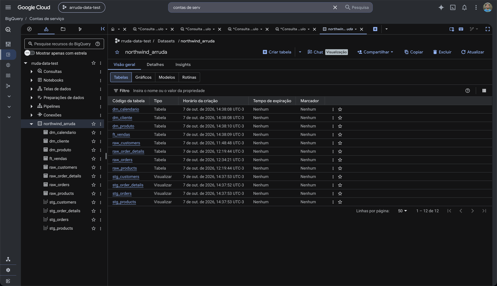
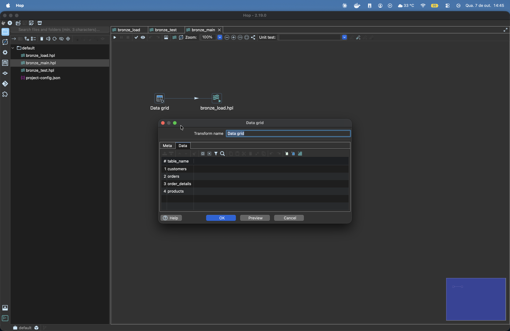
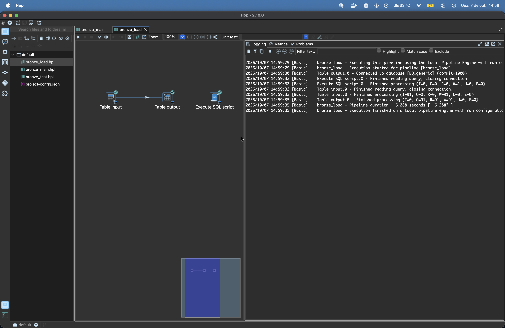
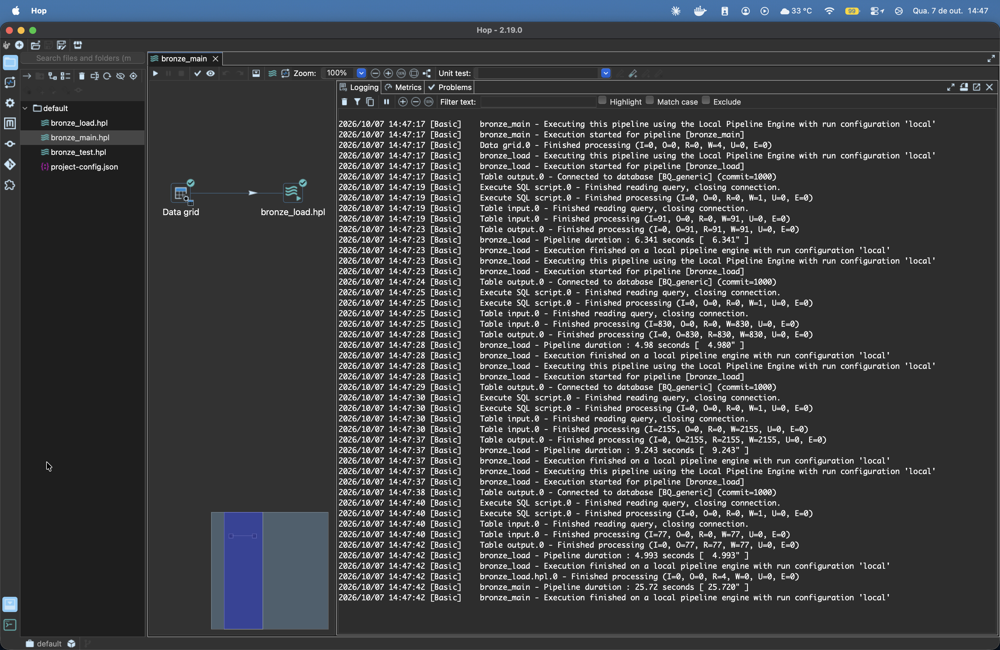
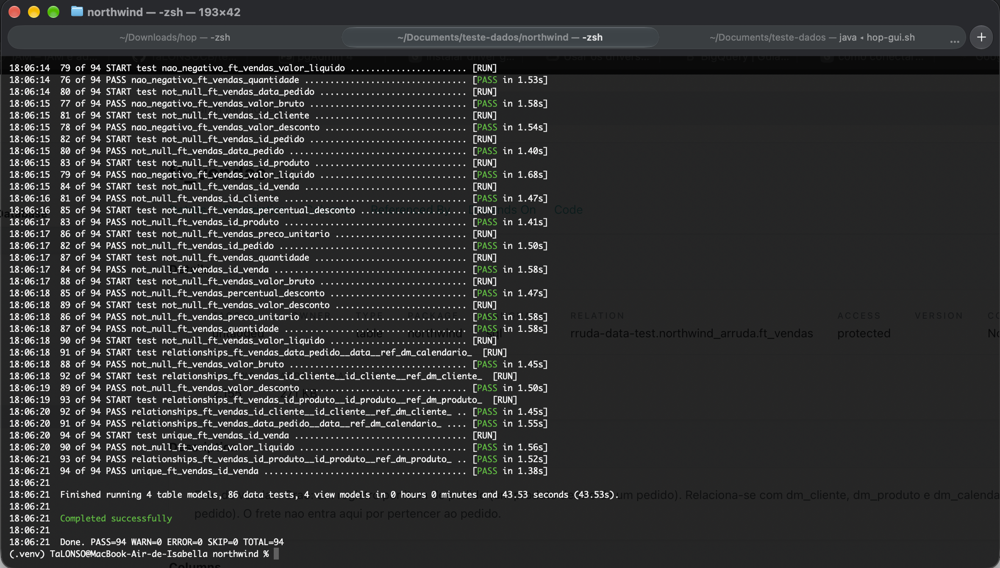
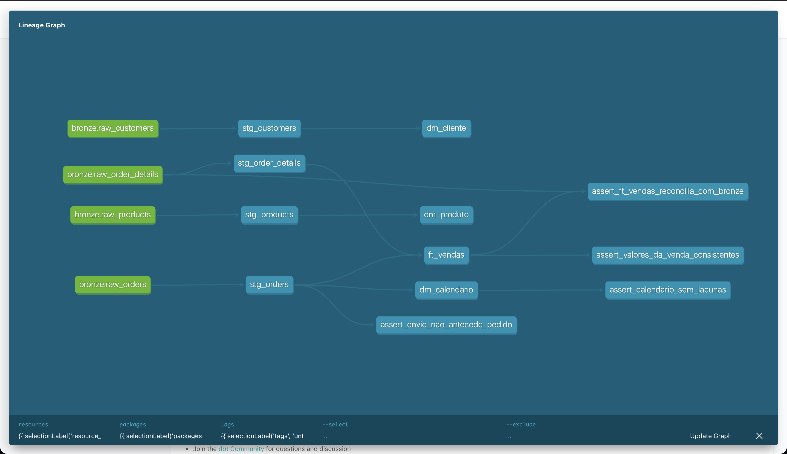

# Teste Técnico Data Engineer - Arruda Data Consulting
Solução do teste técnico de Data Engineer. A base Northwind, que está em um PostgreSQL, é levada para o BigQuery com o Apache Hop (camada Bronze) e depois tratada e modelada com o dbt (camadas Silver e Gold).

### Programas utilizados:
* [Docker](https://www.docker.com/get-started) e docker-compose para subir o PostgreSQL de origem
* [Apache Hop 2.19](https://hop.apache.org) para a ingestão
* [Driver JDBC da Simba para o BigQuery](https://cloud.google.com/bigquery/docs/reference/odbc-jdbc-drivers)
* [Google BigQuery](https://cloud.google.com/bigquery?hl=pt-br) como destino das três camadas
* [dbt](https://www.getdbt.com) (dbt-core 1.9 com dbt-bigquery) para a Silver e a Gold
* [pgAdmin](https://www.pgadmin.org) para conferir os dados na origem

## Como ficou a solução

```
PostgreSQL (Northwind)  --Apache Hop-->  BRONZE (raw_)  --dbt-->  SILVER (stg_)  --dbt-->  GOLD (ft_ e dm_)
```

* `docker-compose.yml`: sobe o PostgreSQL de origem já com a base Northwind carregada
* `hop/`: pipelines do Hop (`bronze_main.hpl` e `bronze_load.hpl`) e conexões
* `northwind/`: projeto dbt, com os modelos, os testes e as descrições
* `sql/bronze_ddl.sql`: DDL das tabelas da Bronze
* `run.sh`: execução de todas as etapas em sequência
* `docs/erros-e-solucoes.md`: anotações dos erros encontrados e suas respectivas soluções

Escolhi o BigQuery como destino porque é o banco com que eu mais trabalho no dia a dia. Deixei as três camadas no mesmo conjunto de dados (`northwind_arruda`), separadas pelo prefixo das tabelas, do jeito que o enunciado descreve.



## Como executar

* Subir a origem. O `docker-compose.yml` da raiz baixa o script da base Northwind do repositório indicado no teste e sobe um PostgreSQL 16 com ela carregada:
```bash
docker-compose up -d
```
O banco fica em `localhost:55432` (banco `northwind`, usuário e senha `postgres`). A imagem está fixada em `postgres:16` porque o compose original usa a versão mais recente, e o PostgreSQL 18 não sobe com o volume que ele configura (está no arquivo de erros).

* Instalar o driver do BigQuery no Hop, que não vem junto. Do zip do [driver da Simba](https://cloud.google.com/bigquery/docs/reference/odbc-jdbc-drivers), copiar para a pasta `lib/jdbc` do Hop somente estes arquivos:
```
GoogleBigQueryJDBC42.jar  api-common-*.jar  gax-*.jar  json-*.jar  threetenbp-*.jar
google-api-services-bigquery-v2-*.jar  google-cloud-bigquerystorage-*.jar
grpc-google-cloud-bigquerystorage-*.jar  proto-google-cloud-bigquerystorage-*.jar
```
Os arquivos `grpc-alts`, `grpc-api`, `grpc-core` e `grpc-netty-shaded` não devem ser copiados, porque dão conflito com as bibliotecas do próprio Hop.

* Instalar o dbt em um ambiente virtual:
```bash
python3 -m venv .venv && source .venv/bin/activate
pip install "dbt-core>=1.9,<1.10" "dbt-bigquery>=1.9,<1.10"
```

* Informar a pasta do Hop e a chave da conta de serviço do Google Cloud (a conta precisa do papel de Administrador do BigQuery):
```bash
export HOP_HOME=/caminho/para/hop
export DBT_KEYFILE=/caminho/para/chave-da-conta-de-servico.json
```
O projeto, o conjunto de dados e a região estão no `northwind/profiles.yml` (dbt) e no `hop/project-config.json` (Hop). Para rodar em outro projeto do Google Cloud, é preciso trocar nesses dois arquivos. A chave não está no repositório: o caminho dela entra só pela variável de ambiente.

* Rodar o pipeline completo:
```bash
./run.sh
```
O script executa, nessa ordem: criação das tabelas `raw_` (se ainda não existirem), ingestão pelo Hop, testes das tabelas da Bronze, modelos do dbt, testes da Silver e da Gold e geração da documentação. Para abrir a documentação no navegador: `cd northwind && dbt docs serve`.

Na primeira execução em um ambiente novo pode aparecer um erro `NOT_FOUND` na ingestão, porque o BigQuery demora alguns minutos para liberar a gravação em uma tabela recém-criada. Basta esperar um pouco e rodar de novo.

## Decisões tomadas

### Camada Bronze (Apache Hop)
* Em vez de fazer um pipeline para cada tabela, eu fiz um pipeline só (`bronze_load`) que recebe o nome da tabela pelo parâmetro `TABLE_NAME`. Ele lê `SELECT * FROM ${TABLE_NAME}` no PostgreSQL e grava em `raw_${TABLE_NAME}` no BigQuery. O `bronze_main` tem a lista das 4 tabelas e chama o `bronze_load` uma vez para cada. Se precisar incluir mais uma tabela, basta acrescentar uma linha nessa lista.



* A Bronze é cópia fiel da origem, com as mesmas colunas e os mesmos nomes, sem nenhuma regra de negócio.
* Antes de gravar, o pipeline faz um `TRUNCATE` na tabela de destino, assim eu posso rodar quantas vezes quiser sem duplicar os dados. Como a base é pequena (umas 3 mil linhas no total), optei por carga completa mesmo.



* Para gravar no BigQuery eu precisei criar uma conexão do tipo genérico usando o driver da Simba, porque o Table output do Hop não aceita a conexão do tipo "Google BigQuery". Essa foi a parte que mais me deu trabalho, está detalhada no arquivo de erros.
* A carga estava muito lenta no começo (3 minutos e meio para as 91 linhas de clientes), porque o driver mandava um insert por linha. Ativei a Storage Write API na URL da conexão e a mesma carga passou a levar 5 segundos. As 4 tabelas juntas levam uns 30 segundos.



* As datas da tabela de pedidos ficaram como `DATETIME` na Bronze, porque esse modo de gravação não aceita o formato de data que o Hop envia em colunas `DATE`. É a única diferença de tipo em relação à origem, e eu converto para `DATE` na Silver.

### Camada Silver (dbt)
* Fiz um modelo `stg_` para cada tabela, como view, assim eles sempre refletem o que está na Bronze.
* Renomeei as colunas para nomes de negócio em português (`id_cliente`, `data_pedido`, `valor_frete` e assim por diante).
* Tirei os espaços das pontas dos textos e transformei texto vazio em nulo.
* Na Silver eu não invento valor. Se o campo não foi preenchido na origem, ele continua nulo.
* Os valores de preço, desconto e frete vêm como `FLOAT` do PostgreSQL. Converti para `NUMERIC` e arredondei, para as somas da Gold não darem diferença de centavos.

### Camada Gold (dbt)
* A `ft_vendas` está no grão de item do pedido (um produto dentro de um pedido), com as chaves de cliente, produto e data do pedido.
* As métricas são: valor bruto (preço x quantidade), valor do desconto (valor bruto x percentual de desconto) e valor líquido (valor bruto menos o desconto).
* Não coloquei o frete na fato, porque o frete é do pedido inteiro e não do item. Se eu trouxesse para esse grão ele ia se repetir em cada item e a soma ficaria errada.
* O preço que eu uso na fato é o que foi praticado na venda. O preço de tabela atual do produto fica na `dm_produto`. Conferi e em 662 dos 2.155 itens os dois são diferentes, o que é normal.
* Nas dimensões eu troquei os valores nulos por "Não informado", para eles não sumirem quando alguém filtrar ou agrupar em um relatório.
* Usei as chaves da própria origem nas dimensões. Como a base não guarda histórico de alteração, não vi necessidade de criar chave substituta nesse teste.
* A `dm_calendario` é gerada no próprio dbt com `GENERATE_DATE_ARRAY`. Ela cobre os anos completos de 1996 a 1998, para as análises por trimestre e por ano não ficarem cortadas no meio.
* A `dm_cliente` tem todos os clientes, inclusive os 2 que nunca fizeram pedido.

## Inconsistências encontradas e como foram tratadas
Antes de modelar eu rodei uma consulta de perfil em cima das tabelas da Bronze para ver o que tinha de problema. A base está certa na estrutura (não achei chave duplicada, registro órfão, nem quantidade ou preço negativo), o que apareceu foi problema de preenchimento e de tipo:

| O que encontrei | Quantos | O que fiz |
|---|---|---|
| Região do cliente vazia | 60 de 91 | Fica nulo na Silver e "Não informado" na dm_cliente |
| Fax e CEP do cliente vazios | 22 e 1 | Ficam nulos na Silver |
| Pedidos sem data de envio | 21 de 830 | Mantive a data nula e criei a coluna `pedido_enviado` |
| Região e CEP de entrega vazios | 507 e 19 | Ficam nulos na Silver |
| Clientes sem nenhum pedido | 2 | Mantive na dm_cliente |
| Preço, desconto e frete em ponto flutuante | todas as linhas | Converti para NUMERIC |
| Produto descontinuado como 0 e 1 | 77 produtos | Converti para booleano |
| Datas com hora na Bronze | 830 pedidos | Converti para DATE |

* Sobre os 21 pedidos sem data de envio: são os pedidos mais recentes da base (de abril e maio de 1998), que ainda não tinham sido enviados. Preferi não preencher com nenhuma data, porque isso iria distorcer qualquer análise de prazo.
* Também vi que 37 pedidos foram enviados depois do prazo combinado. Isso eu não tratei, porque não é erro no dado, é o que aconteceu de fato.

## Testes e documentação
* No total são 86 testes e todos passam.



* Usei os testes do próprio dbt: `not_null` e `unique` nas chaves, `relationships` entre as tabelas (inclusive da fato para as três dimensões) e `accepted_values` nas colunas que têm valores fixos.
* Criei três testes genéricos, que ficam em `northwind/tests/generic`: `nao_negativo`, `entre_zero_e_um` (para o percentual de desconto) e `chave_composta_unica` (para garantir que não se repete pedido + produto).
* Criei também quatro testes específicos em `northwind/tests`. O que eu acho mais importante é o `assert_ft_vendas_reconcilia_com_bronze`, que confere se a fato tem a mesma quantidade de linhas e o mesmo valor bruto total da Bronze, ou seja, se eu não perdi nem dupliquei nada nos joins. Os outros conferem a conta do valor líquido, se o calendário não tem dia faltando e se nenhum pedido foi enviado antes de ser feito.
* Os testes das tabelas da Bronze rodam antes da transformação, para não transformar dado que chegou errado.
* Todas as tabelas e colunas da Silver e da Gold têm descrição, nos arquivos `silver.yml` e `gold.yml`, e a documentação é gerada com `dbt docs generate`.



## Erros que tive no caminho
Eu costumo anotar os erros que aparecem enquanto estou desenvolvendo, até para lembrar depois do passo a passo que eu fiz. Estão todos no arquivo [docs/erros-e-solucoes.md](docs/erros-e-solucoes.md), com a mensagem, a causa e como resolvi. Os que mais mudaram o resultado final foram:
* o Table output do Hop não aceitar a conexão do tipo BigQuery, o que me levou para a conexão genérica
* o BigQuery só aceitar transação dentro de uma sessão, e a sessão precisar da região do conjunto de dados
* a carga linha a linha ser lenta demais, resolvida com a Storage Write API
* a coluna de data não aceitar o formato enviado pelo Hop, por isso o `DATETIME` na Bronze

## O que eu faria com mais tempo
* Carga incremental na Bronze e modelos incrementais no dbt, em vez de recarregar tudo sempre.
* Chave substituta e histórico nas dimensões (SCD tipo 2), usando os snapshots do dbt.
* Trazer as outras tabelas do Northwind para ter dimensão de categoria, fornecedor, funcionário e transportadora, e uma fato de pedidos com o frete e o atraso de entrega.
* Trocar a gravação por JDBC por carga de arquivo (extrair para Parquet e fazer um load no BigQuery), que é o mais indicado quando o volume é grande.
* Separar cada camada em um conjunto de dados, com permissões diferentes.
* Usar um orquestrador de verdade no lugar do `run.sh`, com agendamento, nova tentativa e alerta.
* Colocar o Hop e o dbt em container também, para o ambiente inteiro subir com um comando. Hoje o docker-compose do projeto cobre só a origem.
* Rodar os testes automaticamente a cada alteração no repositório.
* Atualizar o Python e o dbt. Usei o dbt 1.9 porque era a versão estável compatível com o Python 3.9 da minha máquina.
